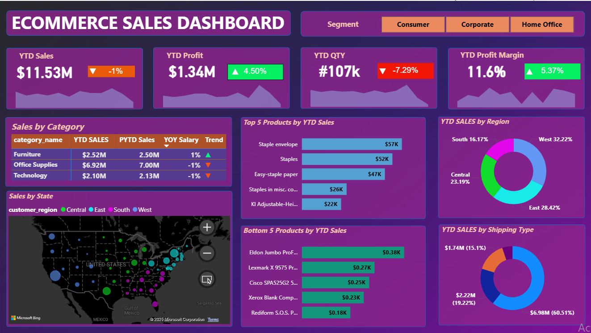

# 📊 Ecommerce Sales Dashboard (Power BI)

This project is an interactive *Power BI dashboard* that analyzes eCommerce sales performance across different categories, regions, and shipping types.

---

## 📈 Key Insights
- *YTD Sales:* $11.53M (-1%)
- *YTD Profit:* $1.34M (+4.56%)
- *YTD Quantity:* 107K (-7.29%)
- *Profit Margin:* 11.6% (+5.37%)

📍 *Category Performance:*
- Furniture: +1%
- Office Supplies: +7%
- Technology: -14%

---

## 🧠 Dashboard Features
- Interactive map of sales by U.S. states  
- KPIs for Sales, Profit, Quantity, and Margin  
- Breakdown by category, region, and shipping type  
- Trend visuals and YOY comparisons  

---

## 🛠 Tools Used
- *Power BI*
- *Excel / CSV (Data Source)*
- *DAX* for measures & calculations

---

## 📸 Dashboard Preview

---

## 💡 About This Project
This dashboard demonstrates my skills in:
- Data cleaning and modeling  
- DAX calculations  
- Building insightful visualizations  
- Storytelling with data  

---

⭐ If you like this project, consider giving it a *star* on GitHub!
